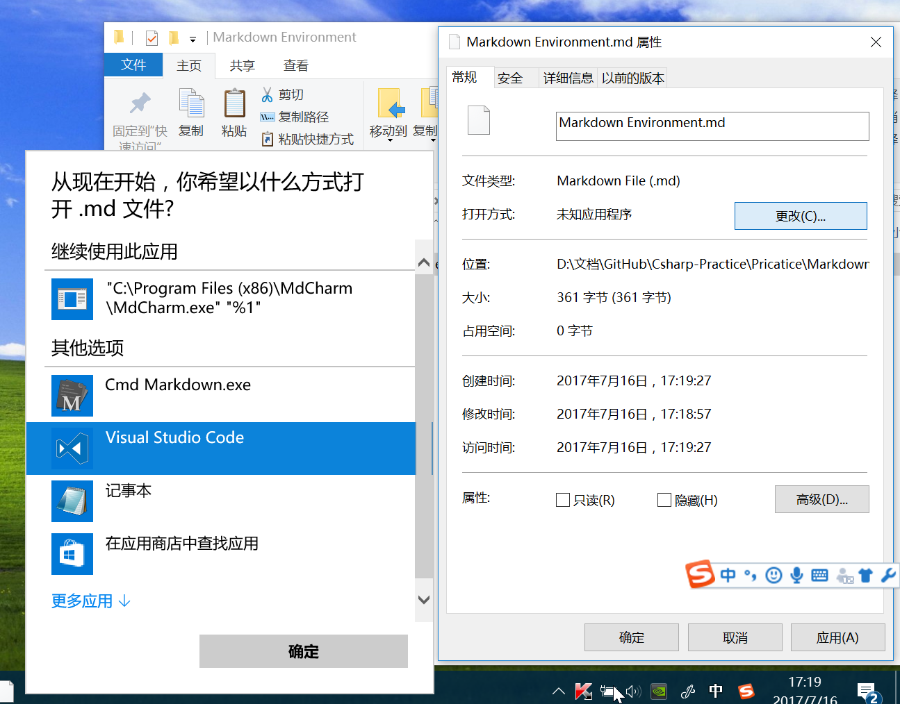
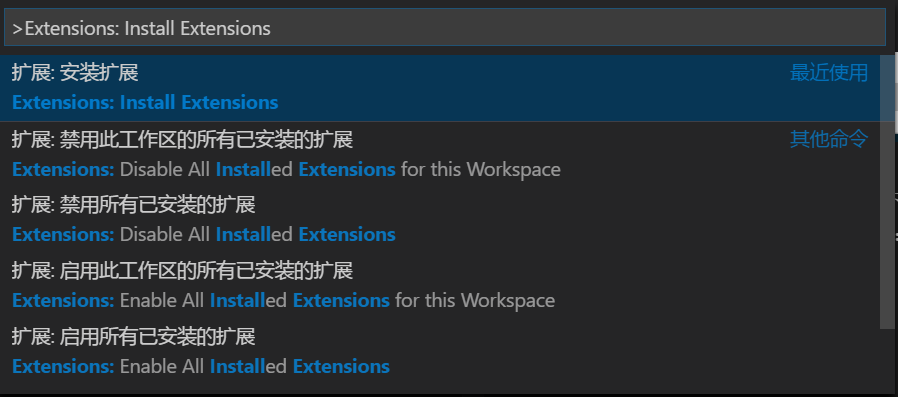
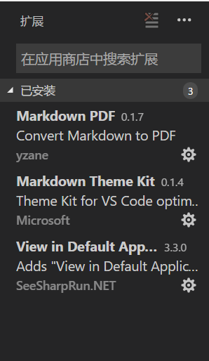

# 搭建markdown的本地开发环境
> 一个免费并且好用的markdown编辑器：Visual Studio Code.

## 步骤
1. 到[Visual Studio Code官网](https://code.visualstudio.com/)上下载Visual Studio Code。
> 请放心，软件下载下来之后软件界面是中文的。

2. 安装并且打开Visual Studio Code
3. 关联.md文件用Visual Studio Code打开.

4. 双击打开要使用的.md文件
5. 在Visual Studio Code界面下，按下f1，打开命令提示，并在里面输入
Extensions: Install Extensions ，并且选择扩展：安装扩展

6. 在左侧弹出的扩展中，搜索并且安装Markdown PDF 和 Markdown Theme Kit.

7. 安装成功之后重启Visual Studio Code，再次打开Markdown文件，可以看到右上角有一个分屏加放大镜的图标，点击即可变成左边是Markdown，右边是预览。
8. 若要把写好的Markdown文件转换为PDF文件，直接按f1，输入Convert Markdown to PDF，点击执行，过一会当前Markdown文件夹里会出现对应的PDF文件。
